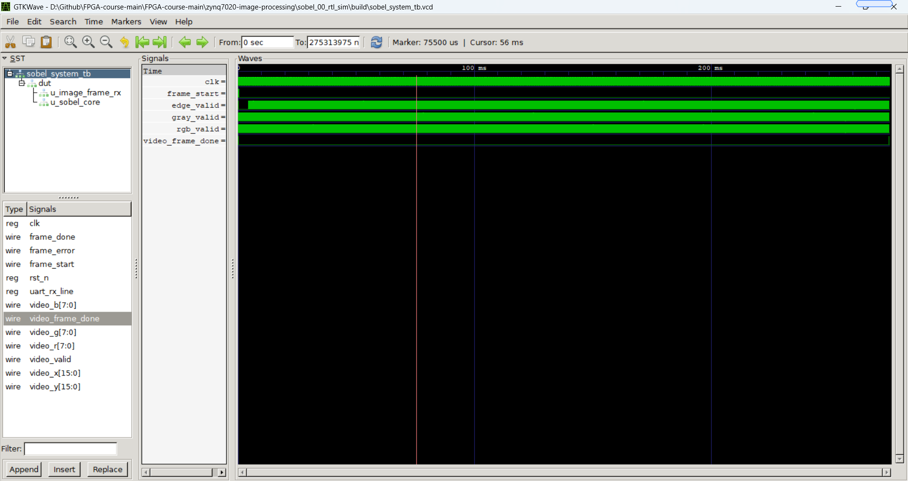
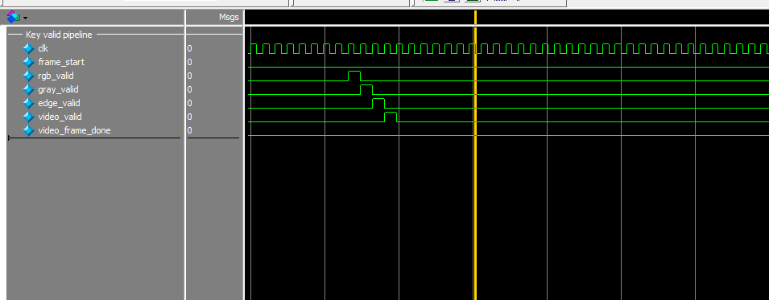
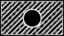

# 实验 0：Sobel 边缘检测 RTL 仿真报告

## 1. 实验目的

本实验为 ZYNQ7020 图像处理课程设计的预备 RTL 仿真实验。实验不依赖 Vivado 工程和开发板，使用 Verilog testbench 对 UART 图像输入、图像帧解析、RGB 转灰度、Sobel 边缘检测和视频流输出模型进行联调验证。

通过本实验需要完成以下目标：

1. 理解 `128 x 72`、`RGB888` 图像以 UART 字节流方式输入 FPGA 的数据格式。
2. 验证 UART 帧头、行头、行号和像素数据的解析流程。
3. 验证 `rgb_to_gray` 模块对 RGB 像素的灰度转换功能。
4. 验证 `sobel_core` 模块对图像边缘的检测效果。
5. 通过输出图像和关键波形判断一帧图像是否完成处理。
6. 在默认输入图像之外更换输入图案，观察不同图像特征对 Sobel 输出结果的影响。

## 2. 实验环境与文件结构

本实验使用 Icarus Verilog 进行 RTL 编译和仿真，使用 GTKWave 查看 VCD 波形，使用 Python 脚本生成输入图像并将仿真输出转换为 PNG 图片。

主要文件结构如下。

| 文件或目录 | 作用 |
| --- | --- |
| `rtl/uart_rx.v` | UART 串行接收模块，将串行位流恢复为 8 位并行字节 |
| `rtl/image_frame_rx.v` | 图像帧协议解析模块，识别帧头、行头、行号和 RGB 数据 |
| `rtl/rgb_to_gray.v` | RGB888 转灰度模块 |
| `rtl/sobel_core.v` | Sobel 边缘检测核心 |
| `rtl/video_stream_model.v` | 视频流输出模型，用于仿真输出一帧处理结果 |
| `rtl/sobel_system.v` | 顶层模块，连接 UART、帧解析、灰度转换和 Sobel 核心 |
| `tb/sobel_system_tb.v` | 仿真 testbench，构造 UART 输入并检查输出 |
| `data/input_rgb.hex` | 默认输入图像的 RGB888 十六进制数据 |
| `tools/gen_input_rgb.py` | 默认输入图像生成脚本 |
| `tools/gen_alternative.py` | 扩展输入图像生成脚本 |
| `tools/convert_images.py` | PGM/HEX 图像结果转换工具 |
| `build/` | 默认输入图像的仿真输出目录 |
| `build1/` | 扩展输入图像的仿真输出目录 |

## 3. 系统数据流

实验顶层模块 `sobel_system` 将各个 RTL 子模块串联成完整图像处理链路。整体数据流如下：

```text
input_rgb.hex
    -> UART byte stream model
    -> uart_rx
    -> image_frame_rx
    -> rgb_to_gray
    -> sobel_core
    -> video_stream_model
    -> sobel_out.pgm / sobel_out.png
```

其中，testbench 从 `input_rgb.hex` 读取 RGB 数据，将其按 UART 帧格式逐字节发送到 `uart_rx`。后续模块完成图像帧解析、灰度转换、Sobel 边缘计算，并最终输出一帧灰度边缘图。

## 4. UART 图像帧格式

仿真中的图像帧格式与后续上板实验保持一致。单帧图像由帧头、若干行数据组成，每一行又包含行头和像素数据。

```text
frame header: 55 AA width_l width_h height_l height_h 18
line header : 33 CC row_l row_h
pixel data  : R G B, repeated 128 times per row
```

各字段含义如下。

| 字段 | 含义 |
| --- | --- |
| `55 AA` | 一帧图像开始标志 |
| `width_l width_h` | 图像宽度，小端序 16 位，本实验为 `128` |
| `height_l height_h` | 图像高度，小端序 16 位，本实验为 `72` |
| `18` | 图像格式标志，表示 RGB888 |
| `33 CC` | 每一行图像数据的同步头 |
| `row_l row_h` | 当前行号，小端序 16 位 |
| `R G B` | 单个像素的红、绿、蓝三个分量 |

testbench 中还构造了错误帧头、错误格式和错误行号三类异常输入，用于验证接收模块的错误检测逻辑。只有合法的 RGB888 图像帧会继续进入后续灰度转换和 Sobel 处理模块。

## 5. 关键模块说明

### 5.1 UART 接收模块

`uart_rx` 模块将 UART 串行位流恢复为 8 位并行字节，并在一个字节接收完成时给出 `rx_valid` 脉冲。每个 UART 字节由 1 个起始位、8 个数据位和 1 个停止位构成，数据位按 LSB 优先顺序传输。

本 testbench 中为了提高仿真速度，将时钟频率设置为 `12 MHz`，波特率设置为 `1 Mbps`，因此每个 UART bit 对应 12 个时钟周期。该设置用于加速 RTL 仿真，协议格式仍与后续上板实验一致。

### 5.2 图像帧解析模块

`image_frame_rx` 模块从 UART 字节流中解析完整图像帧。模块首先搜索帧同步头 `0x55 0xAA`，随后读取图像宽度、高度和格式字段。格式校验通过后，模块逐行搜索 `0x33 0xCC` 行同步头，并检查行号是否连续。

当某个像素的三个 RGB 字节全部接收完成后，模块输出：

```text
rgb_valid = 1
r, g, b   = 当前像素 RGB 分量
x, y      = 当前像素坐标
```

若帧头、格式或行号错误，模块输出 `frame_error`，不会向后级模块输出有效像素。

### 5.3 RGB 转灰度模块

`rgb_to_gray` 模块采用加权灰度公式：

```text
gray = (R * 77 + G * 150 + B * 29) >> 8
```

该公式近似对应常用亮度权重 `0.299R + 0.587G + 0.114B`。模块在 `rgb_valid` 有效后输出 `gray_valid`，并同步传递像素坐标。

### 5.4 Sobel 边缘检测模块

`sobel_core` 模块使用 `3 x 3` 滑动窗口计算水平和垂直方向梯度。两个 Sobel 卷积核如下：

```text
Gx = [-1  0  +1]      Gy = [-1 -2 -1]
     [-2  0  +2]           [ 0  0  0]
     [-1  0  +1]           [+1 +2 +1]
```

为避免硬件中引入开方运算，边缘强度采用近似形式：

```text
edge = |Gx| + |Gy|
```

当计算结果大于 255 时，输出饱和为 255。图像最外侧边界像素缺少完整 `3 x 3` 邻域，因此边界输出被置为 0。模块内部通过两行行缓存和移位寄存器维护滑动窗口，并在一帧图像处理结束后输出 `edge_frame_done`。

## 6. 默认图像仿真结果

默认输入图像分辨率为 `128 x 72`，包含横向/纵向渐变、中央亮色矩形、红色竖线和对角暗色线条，适合观察不同方向和不同强度边缘的响应。


图 1 默认输入图像

Sobel 输出图如下。


图 2 默认输入图像的 Sobel 边缘检测输出

从输出结果可以看到，中央亮色矩形的边界、红色竖线边界以及对角线均被检测出来。背景渐变区域变化较缓，因此输出灰度值较低；强对比度区域输出亮度更高，说明 Sobel 模块能够正确反映局部灰度梯度。

## 7. 关键仿真波形

整体仿真波形截图如下。该图用于确认复位、UART 接收、帧解析、灰度转换、Sobel 计算和输出完成信号均参与了一次完整帧处理过程。



图 3 关键仿真波形总览

波形中重点观察以下信号：

| 信号 | 说明 |
| --- | --- |
| `frame_start` | 图像帧开始解析时产生的脉冲 |
| `rgb_valid` | `image_frame_rx` 输出 RGB 像素有效 |
| `gray_valid` | `rgb_to_gray` 输出灰度像素有效 |
| `edge_valid` | `sobel_core` 输出边缘像素有效 |
| `video_frame_done` | 输出模型完成一帧视频流输出 |

为了更清楚地展示模块之间的时序关系，将 VCD 波形导入 ModelSim，并对 Sobel 开始输出后的局部时段进行放大，如图 4 所示。



图 4 ModelSim 中 Sobel 处理通路局部有效信号波形

局部波形中，`rgb_valid` 首先表示 `image_frame_rx` 输出一个 RGB 像素；随后 `gray_valid` 拉高，说明灰度转换模块完成该像素的灰度计算；之后 `edge_valid` 输出 Sobel 边缘结果；最后 `video_valid` 拉高，将边缘像素送入视频流输出模型。各级 `valid` 信号按时钟节拍依次错开，符合 RGB 输入、灰度转换、Sobel 边缘检测和视频输出之间的流水处理关系。`video_frame_done` 最终拉高，表示一帧图像的 Sobel 处理和输出已经结束。

仿真控制台输出如下：

```text
VCD info: dumpfile build/sobel_system_tb.vcd opened for output.
Sobel RGB888 simulation passed
Output image: build/sobel_out.pgm
Waveform: build/sobel_system_tb.vcd
```

输出信息表明 testbench 检查通过，并成功生成 Sobel 输出图像与 VCD 波形文件。

## 8. 扩展实验：更换输入图像重新仿真

在基础仿真通过后，进一步更换输入图像，使用包含红色边框、斜向条纹、中央圆形和高频纹理的自定义图案重新仿真。该图案与默认渐变图不同，可以检验 Sobel 算子对曲线、斜线和密集纹理的响应。


图 4 扩展实验输入图像

扩展输入图像的 Sobel 输出如下。



图 5 扩展输入图像的 Sobel 边缘检测输出

可以看到，红色边框、斜向条纹和中央圆形边界均形成了明显的高亮边缘。与默认输入图像相比，扩展图像包含更多高频纹理，因此输出边缘分布更加密集。该结果说明 Sobel 模块不仅能检测水平、垂直边缘，也能对斜向边缘和曲线边缘产生明显响应。

默认图像与扩展图像的结果对比如下。

| 对比项 | 默认输入图像 | 扩展输入图像 |
| --- | --- | --- |
| 图案特点 | 渐变背景、矩形、竖线、对角线 | 边框、斜纹、圆形、高频纹理 |
| 边缘分布 | 主要集中在矩形、线条等强变化区域 | 分布更密集，斜纹与圆形边缘明显 |
| 检测效果 | 能正确突出主要轮廓 | 能正确突出曲线和斜向纹理 |
| 结论 | 验证基础边缘检测流程正确 | 验证模块对不同图像特征具有稳定响应 |

## 9. 仿真检查项

本次 testbench 不仅检查正常图像帧，还覆盖了部分异常输入情况。

| 检查项 | 验证方式 | 结果 |
| --- | --- | --- |
| 错误帧头 | 发送 `55 00` 等非法帧头 | 产生 `frame_error`，无视频输出 |
| 错误格式 | 发送非 RGB888 格式标志 | 产生 `frame_error`，无视频输出 |
| 错误行号 | 发送不连续行号 | 产生 `frame_error`，无视频输出 |
| 正常 RGB888 图像 | 发送完整 `128 x 72` RGB888 帧 | 输出像素数等于 `9216` |
| Sobel 输出文件 | 写入 `sobel_out.pgm` 并转换为 PNG | 图像结果正常生成 |

这些检查保证了图像帧协议解析和后续 Sobel 数据流不是单纯依赖固定输入通过，而是具备基本的错误识别能力。

## 10. 仿真中遇到的问题和解决方法

本实验中主要需要处理的问题有三类。

第一类是 UART 字节流与图像帧协议的边界对齐问题。由于 UART 接收模块只负责恢复字节，图像帧是否有效需要由 `image_frame_rx` 继续判断。为避免错误数据进入后级处理，testbench 中增加了错误帧头、错误格式和错误行号的输入检查，确认模块在异常帧下能够输出 `frame_error`，并且不会继续产生有效 RGB 像素。

第二类是 Sobel 滑动窗口的边界处理问题。图像最外侧像素缺少完整的 `3 x 3` 邻域，如果直接参与卷积会引入不确定边缘。因此在 `sobel_core` 中对边界像素统一置 0，只对具备完整邻域的内部像素输出梯度结果，保证输出图像边界稳定。

第三类是仿真效率问题。若完全按照上板串口波特率进行 RTL 仿真，一帧 `128 x 72` RGB888 图像需要较长时间。为提高验证效率，testbench 将 UART 仿真波特率设置为更高的 `1 Mbps`，但仍保持起始位、数据位、停止位和帧格式不变。这样既能缩短仿真时间，也不改变 UART 协议解析逻辑。

通过上述处理，仿真能够稳定生成输出图像和 VCD 波形，并覆盖正常帧与异常帧两类输入情况。

## 11. 总结

本实验完成了 Sobel 边缘检测链路的 RTL 级仿真验证。仿真从 UART 字节流开始，依次经过图像帧解析、RGB 转灰度、Sobel 边缘检测和视频流输出模型，最终生成边缘检测结果图像。默认输入图像验证了矩形、竖线、对角线和渐变区域的边缘响应；扩展输入图像进一步验证了斜纹、圆形和高频纹理的检测效果。

仿真结果表明，`rgb_to_gray` 与 `sobel_core` 模块能够按预期完成图像处理，`image_frame_rx` 能正确解析合法图像帧并拒绝异常帧。该 RTL 仿真为后续 Vivado 工程综合、上板显示和 PC 串口图像输入实验提供了基础验证。
