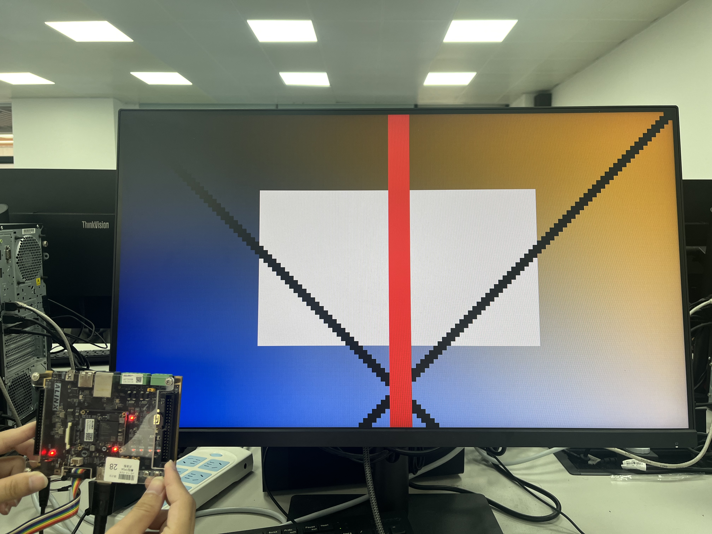
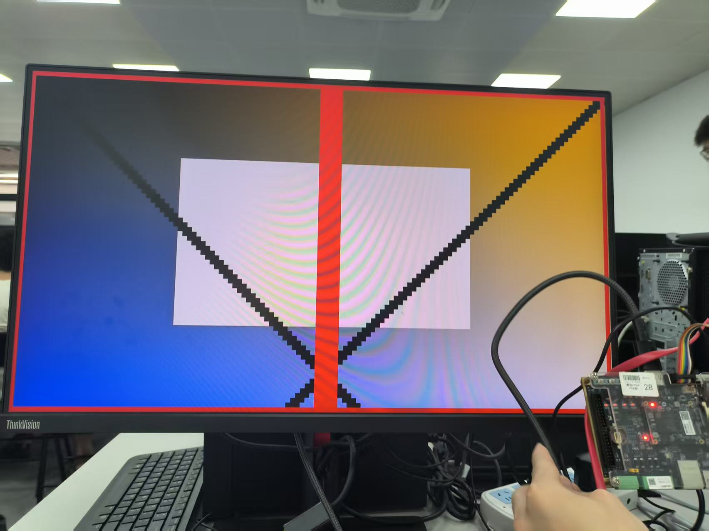
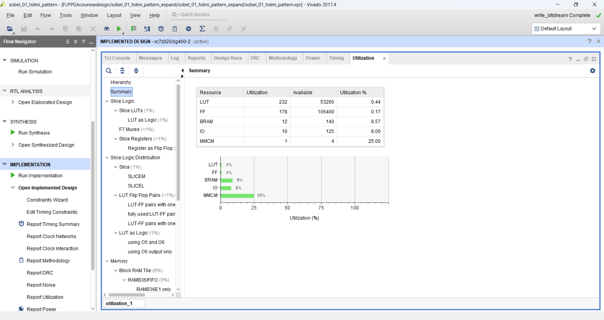
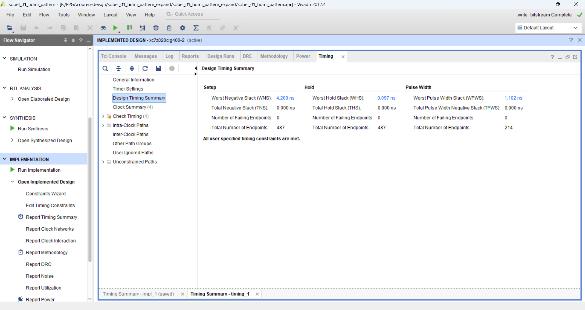

# 实验 1：HDMI 固定图案显示实验报告

## 1. 实验目的

本实验基于 ZYNQ7020 开发板完成 HDMI 固定图案显示。工程将一张 `128 x 72` 的 RGB 图像存放在 Verilog ROM 中，通过 HDMI 显示链路输出到显示器，并在 `1280 x 720` 分辨率下按 `10 x 10` 倍率放大显示。

本实验主要完成以下内容：

1. 搭建 HDMI 输出链路，验证开发板到显示器的 TMDS 输出是否正常。
2. 理解 `video_clock` 和 `rgb2dvi_0` IP 在 HDMI 显示中的作用。
3. 理解 720p 显示时序中的行计数、场计数和有效显示区域。
4. 理解 `128 x 72` ROM 图像到 `1280 x 720` 屏幕坐标的映射关系。
5. 在基础显示功能上增加红色边框，完成 HDMI 显示效果拓展。

## 2. 工程结构

本工程的主要逻辑位于 Vivado 工程目录中，核心文件如下。

| 文件或模块 | 作用 |
| --- | --- |
| `top.v` | 顶层模块，连接 HDMI 图像显示逻辑、时钟 IP 和 RGB 转 DVI IP |
| `hdmi_image_display.v` | 产生 720p 显示时序，完成 ROM 图像读取、坐标缩放和 RGB 输出 |
| `image_rom_128x72` | 图像 ROM，保存 `128 x 72` 图像像素数据 |
| `video_clock` | 时钟 IP，产生 HDMI 像素时钟和 5 倍串行时钟 |
| `rgb2dvi_0` | 将并行 RGB、行同步、场同步和数据有效信号编码为 TMDS HDMI 输出 |
| `hdmi_out_test.xdc` | HDMI 相关管脚约束 |

系统数据流如下：

```text
image_rom_128x72
    -> hdmi_image_display
    -> rgb2dvi_0
    -> HDMI 显示器
```

其中 `hdmi_image_display` 负责产生显示时序并给出 RGB 像素，`rgb2dvi_0` 负责将视频信号转换为 HDMI 接口需要的 TMDS 差分信号。

## 3. HDMI 720p 时序设计

本实验使用 `1280 x 720` 显示分辨率。`hdmi_image_display.v` 中设置的时序参数如下。

| 参数 | 数值 | 含义 |
| --- | ---: | --- |
| `H_ACTIVE` | 1280 | 水平方向有效显示像素数 |
| `H_FP` | 110 | 水平前肩 |
| `H_SYNC` | 40 | 水平同步脉冲宽度 |
| `H_BP` | 220 | 水平后肩 |
| `V_ACTIVE` | 720 | 垂直方向有效显示行数 |
| `V_FP` | 5 | 垂直前肩 |
| `V_SYNC` | 5 | 垂直同步脉冲宽度 |
| `V_BP` | 20 | 垂直后肩 |

因此总行周期和总场周期为：

```text
H_TOTAL = H_ACTIVE + H_FP + H_SYNC + H_BP = 1650
V_TOTAL = V_ACTIVE + V_FP + V_SYNC + V_BP = 750
```

模块内部使用 `h_cnt` 和 `v_cnt` 分别作为行计数器和场计数器。当计数值落在有效显示窗口内时，`video_active` 置 1，并输出有效 RGB 图像数据；否则输出黑色空白区。

有效显示区域判断如下：

```verilog
assign h_active = (h_cnt >= H_START[11:0]) && (h_cnt < (H_START + H_ACTIVE));
assign v_active = (v_cnt >= V_START[11:0]) && (v_cnt < (V_START + V_ACTIVE));
assign video_active = h_active && v_active;
```

## 4. ROM 图像放大显示原理

本实验的原始图像大小为 `128 x 72`，HDMI 输出画面大小为 `1280 x 720`。两者比例正好为：

```text
SCALE_X = 1280 / 128 = 10
SCALE_Y = 720 / 72  = 10
```

因此，ROM 中的每一个图像像素会在 HDMI 屏幕上显示为 `10 x 10` 个屏幕像素。代码中通过当前屏幕有效坐标反推 ROM 图像坐标：

```verilog
assign active_x = h_cnt - H_START[11:0];
assign active_y = v_cnt - V_START[11:0];
assign image_x = active_x / SCALE_X;
assign image_y = active_y / SCALE_Y;
```

对于 `128 x 72` 的图像，ROM 地址计算为：

```verilog
assign image_addr = {image_y, 7'b0} + {7'd0, image_x};
```

该表达式等价于：

```text
image_addr = image_y * 128 + image_x
```

由于 `128 = 2^7`，因此乘法可以用移位完成，适合硬件实现。ROM 中每个像素使用 `24'hRRGGBB` 表示，其中高 8 位为红色分量，中间 8 位为绿色分量，低 8 位为蓝色分量。

## 5. 顶层 HDMI 输出链路

顶层模块 `top.v` 中包含三个核心部分：

1. `video_clock`：由板载系统时钟产生 HDMI 像素时钟 `video_clk` 和 5 倍串行时钟 `video_clk_5x`。
2. `hdmi_image_display`：在像素时钟下产生 `video_hs`、`video_vs`、`video_de` 和 RGB 数据。
3. `rgb2dvi_0`：将 RGB 视频流编码为 HDMI TMDS 差分输出。

顶层连接关系可概括为：

```text
sys_clk
  -> video_clock
      -> video_clk / video_clk_5x
          -> hdmi_image_display
              -> video_r / video_g / video_b / hs / vs / de
                  -> rgb2dvi_0
                      -> TMDS_clk_p/n, TMDS_data_p/n
```

`rgb2dvi_0` 中 `PixelClk` 使用像素时钟，`SerialClk` 使用 5 倍像素时钟，以满足 TMDS 串行输出需求。

## 6. 基础实验现象

基础实验下载 bitstream 后，HDMI 显示器能够正常识别输入信号，并显示由 ROM 图像放大后的画面。显示画面如下。



图 1 基础 HDMI 固定图案显示效果

从图中可以看到，屏幕显示了完整的固定图案，包括渐变背景、白色矩形、红色竖线和黑色斜线。图案铺满 `1280 x 720` 显示区域，说明 `128 x 72` ROM 图像已经按 `10 x 10` 倍率正确放大，HDMI 输出链路工作正常。

## 7. 拓展实验：增加红色边框

在基础显示功能通过后，对 `hdmi_image_display.v` 进行拓展，在有效图像区域边缘增加红色边框。边框判断逻辑如下。

```verilog
parameter BORDER_X = 1;
parameter BORDER_Y = 1;
parameter [7:0] BORDER_R = 8'hff;
parameter [7:0] BORDER_G = 8'h20;
parameter [7:0] BORDER_B = 8'h20;

assign border_on = (image_x <  BORDER_X[6:0]) ||
                   (image_x >= (IMG_WIDTH  - BORDER_X)) ||
                   (image_y <  BORDER_Y[6:0]) ||
                   (image_y >= (IMG_HEIGHT - BORDER_Y));
```

`BORDER_X` 和 `BORDER_Y` 是以原始图像坐标为单位定义的。当前设置为 1，表示在 `128 x 72` 原始图像上增加 1 个像素宽的边框。由于显示时进行了 10 倍放大，因此实际显示到屏幕上约为 10 个屏幕像素宽。

RGB 输出处根据 `border_on` 选择边框颜色或 ROM 图像颜色：

```verilog
assign rgb_r = de_reg_d0 ? (border_on ? BORDER_R : image_pixel[23:16]) : 8'h00;
assign rgb_g = de_reg_d0 ? (border_on ? BORDER_G : image_pixel[15:8] ) : 8'h00;
assign rgb_b = de_reg_d0 ? (border_on ? BORDER_B : image_pixel[7:0]  ) : 8'h00;
```

拓展后的显示效果如下。



图 2 增加红色边框后的 HDMI 显示效果

从图中可以看到，图像四周出现了明显红色边框，内部图案仍然正常显示，没有破坏 ROM 图像内容。该结果说明边框判断逻辑与 ROM 图像输出逻辑能够正确叠加。

## 8. 综合实现与资源占用

工程已完成综合、实现并生成 bitstream，生成的 bit 文件位于：

```text
sobel_01_hdmi_pattern.runs/impl_1/top.bit
```

实现后关键资源占用如下。



图 3 Vivado 资源利用率结果

| 资源 | 使用量 | 可用量 | 占用率 |
| --- | ---: | ---: | ---: |
| Slice LUTs | 232 | 53200 | 0.44% |
| Slice Registers | 178 | 106400 | 0.17% |
| Block RAM Tile | 12 | 140 | 8.57% |
| DSPs | 0 | 220 | 0.00% |
| Bonded IOB | 10 | 125 | 8.00% |
| BUFGCTRL | 3 | 32 | 9.38% |

资源占用中 Block RAM 主要来自图像 ROM 和 HDMI 相关 IP。由于本实验仅完成固定图像读取和 HDMI 输出，逻辑资源占用较低，没有使用 DSP。

## 9. 时序与布线结果

实现后的关键时序结果如下。



图 4 Vivado 时序结果

| 指标 | 数值 |
| --- | ---: |
| WNS | 4.200 ns |
| TNS | 0.000 ns |
| WHS | 0.097 ns |
| THS | 0.000 ns |

Vivado 时序报告显示：

```text
All user specified timing constraints are met.
```

布线报告显示：

```text
fully routed nets: 441
nets with routing errors: 0
```

因此，本工程能够满足时序约束，且布线无错误，可以正常生成 bitstream 并下载到开发板运行。

## 10. 问题分析

本实验中需要注意以下几点：

1. HDMI 显示链路依赖 `video_clock` 和 `rgb2dvi_0` IP，移动工程时需要保留相关 IP 文件和 `hdmi_common` 依赖目录。
2. `image_x`、`image_y` 是低分辨率图像坐标，`active_x`、`active_y` 是 720p 屏幕有效显示坐标，二者之间通过 `SCALE_X`、`SCALE_Y` 建立映射关系。
3. ROM 地址计算必须与图像宽度一致。本实验宽度为 128，因此 `image_y * 128 + image_x` 可以使用移位加法实现。
4. 增加边框时应在有效显示区域内进行判断，并保证消隐区仍输出黑色，否则可能影响 HDMI 显示稳定性。

## 11. 总结

本实验完成了 ZYNQ7020 开发板 HDMI 固定图案显示功能。工程通过 `video_clock` 产生 HDMI 所需时钟，通过 `hdmi_image_display` 产生 720p 时序并读取 `128 x 72` 图像 ROM，通过 `rgb2dvi_0` 输出 TMDS 信号到 HDMI 显示器。

实验结果表明，ROM 图像能够被正确放大到 `1280 x 720` 显示区域，HDMI 输出链路正常工作。在拓展部分中，通过增加 `border_on` 判断逻辑和边框 RGB 输出选择，实现了红色边框显示效果，且不影响内部图案显示。综合实现结果显示工程资源占用较低，时序满足约束，说明该 HDMI 显示基础工程可以作为后续图像处理实验的显示输出基础。
