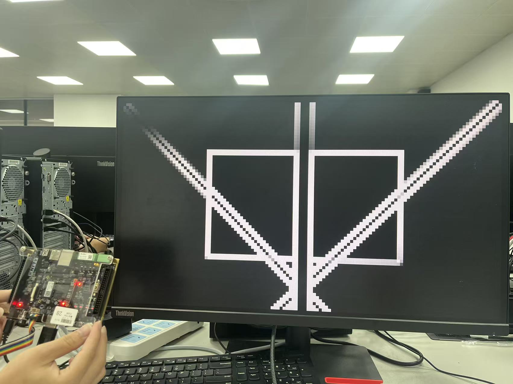
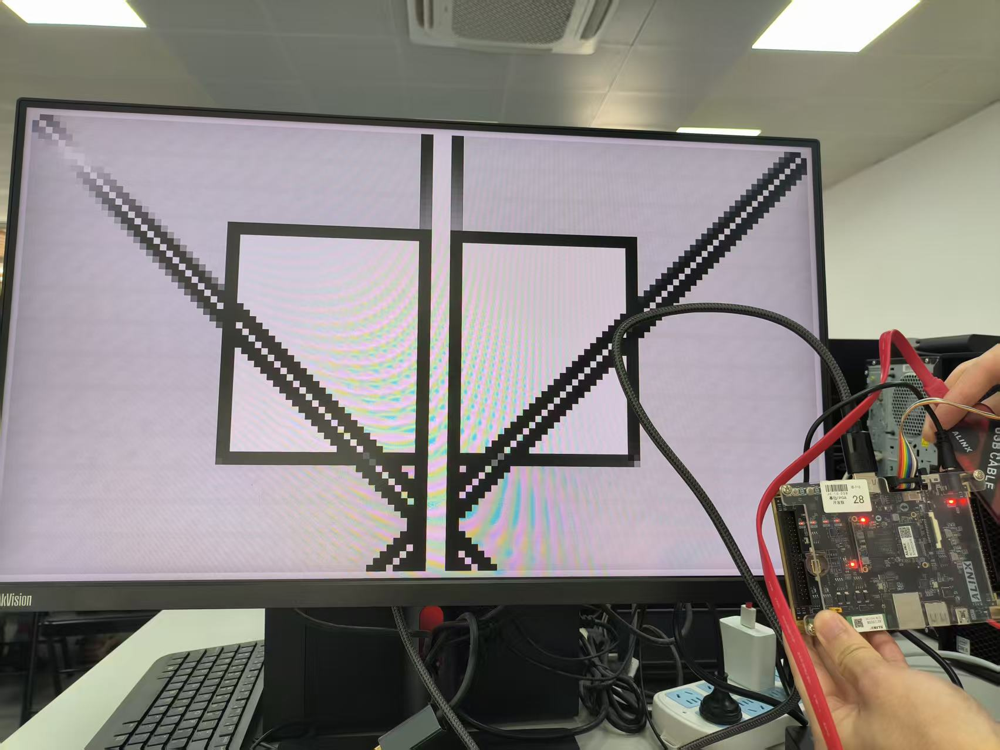
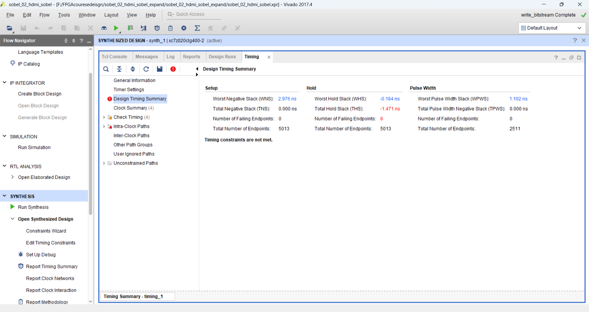
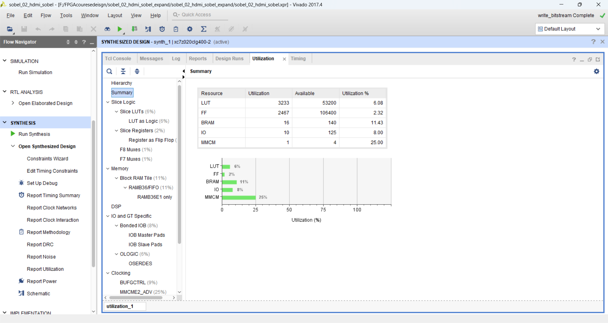

# 实验二：HDMI 固定图像 Sobel 边缘检测

## 一、实验目的

本实验在实验一 HDMI 固定图片显示的基础上，加入 RGB 灰度转换和 Sobel 边缘检测模块，使 Zynq-7020 的 PL 端能够直接完成固定图片的边缘提取，并通过 HDMI 输出处理后的边缘图像。实验输入图像尺寸为 `128 x 72`，显示端采用 `1280 x 720` HDMI 输出，因此每个源图像像素在显示时被放大为 `10 x 10` 的显示区域。

在基础功能完成后，进一步对 Sobel 输出结果进行反色显示，使原本的黑底白边显示变为浅底黑边显示，从而观察输出映射方式对最终显示效果的影响。

## 二、整体设计方案

系统整体采用固定图片 ROM 输入，先读取 `128 x 72` 的 RGB888 图像数据，然后依次经过灰度转换、Sobel 卷积、边缘结果缓存和 HDMI 显示输出。整体数据流如下：

```text
image_rom_128x72
    -> rgb_to_gray
    -> sobel_core
    -> edge_mem
    -> hdmi_sobel_display
    -> rgb2dvi_0
    -> HDMI 显示器
```

其中，`image_rom_128x72.v` 保存固定输入图像；`rgb_to_gray.v` 将 RGB888 图像转换为 8 bit 灰度；`sobel_core.v` 对灰度图像进行边缘检测；`edge_mem` 保存一帧 Sobel 输出结果；`hdmi_sobel_display.v` 负责 HDMI 时序、图像地址映射、边缘结果读取和 RGB 输出。

## 三、关键模块说明

### 3.1 HDMI 显示与图像地址映射

HDMI 输出分辨率为 `1280 x 720`，源图像分辨率为 `128 x 72`，横向和纵向放大倍数均为 10。显示过程中，当前 HDMI 有效显示坐标先除以缩放倍数，得到源图像坐标：

```verilog
assign disp_x = active_x / SCALE_X;
assign disp_y = active_y / SCALE_Y;
assign disp_addr = {disp_y, 7'b0} + {7'd0, disp_x};
```

由于源图像宽度为 128，地址计算等价于：

```text
addr = y * 128 + x
```

这样可以将 `128 x 72` 的 Sobel 输出结果铺满 `1280 x 720` 显示区域。

### 3.2 RGB 转灰度

灰度转换模块使用整数加权近似公式：

```verilog
gray_calc = r * 77 + g * 150 + b * 29;
gray      = gray_calc[15:8];
```

该计算对应常用亮度权重：

```text
Gray ≈ 0.299R + 0.587G + 0.114B
```

使用移位截取的方式可以避免除法运算，更适合 FPGA 中的硬件实现。

### 3.3 Sobel 边缘检测

Sobel 模块通过两行缓存和当前像素形成 `3 x 3` 窗口，分别计算水平和垂直方向梯度：

```text
Gx = -p00 + p02 - 2p10 + 2p12 - p20 + p22
Gy = -p00 - 2p01 - p02 + p20 + 2p21 + p22
```

边缘强度采用绝对值近似：

```text
Edge = |Gx| + |Gy|
```

当边缘强度超过 255 时进行饱和处理，保证输出仍为 8 bit 数据。图像边界处缺少完整的 `3 x 3` 邻域，因此边界输出置 0。

### 3.4 边缘结果缓存

Sobel 处理结果通过 `edge_valid` 指示有效，在有效时写入 `edge_mem`：

```verilog
always @(posedge clk) begin
    if (edge_valid) begin
        edge_mem[edge_wr_addr] <= edge_data;
    end
end
```

当一帧图像处理完成后，`sobel_done` 置位，显示模块开始从 `edge_mem` 读取边缘结果并输出到 HDMI。这样可以避免边处理边显示时由于数据尚未稳定造成的画面不完整问题。

## 四、基础功能实现结果

基础功能中，Sobel 输出结果直接映射到 RGB 三个通道，强边缘显示为白色，无边缘区域显示为黑色。上板后 HDMI 显示器输出如下：



从显示结果可以看出，输入图像中的矩形边框、斜线和竖线均被提取出来，边缘区域亮度较高，背景区域保持较暗。由于源图像分辨率为 `128 x 72` 并进行了 10 倍放大，边缘在显示器上呈现出较明显的像素块状特征，这是固定低分辨率输入放大显示后的正常现象。

## 五、拓展功能：边缘反色显示

拓展部分在基础 Sobel 结果上修改 RGB 输出映射，将边缘灰度值进行反色处理：

```verilog
wire [7:0] edge_inv;
assign edge_inv = 8'hFF - edge_pixel;

assign rgb_r = (de_reg_d0 && sobel_done) ? edge_inv : 8'h00;
assign rgb_g = (de_reg_d0 && sobel_done) ? edge_inv : 8'h00;
assign rgb_b = (de_reg_d0 && sobel_done) ? edge_inv : 8'h00;
```

原始 Sobel 输出中，强边缘接近 255，背景接近 0，因此显示为黑底白边。反色后，强边缘变为接近 0，背景变为接近 255，因此显示效果变为浅底黑边：



反色显示没有改变 Sobel 算法本身，只改变了输出到 HDMI 的像素映射方式。该拓展验证了图像处理链路后端显示映射的可调性，也说明边缘结果在写入 `edge_mem` 后可以继续进行显示增强或可视化变换。

## 六、综合实现结果

工程完成综合、实现并生成 bitstream，生成文件为：

```text
sobel_02_hdmi_sobel.runs/impl_1/top.bit
```

时序报告显示：



| 指标 | 数值 |
| --- | ---: |
| WNS | 0.918 ns |
| TNS | 0.000 ns |
| WHS | 0.069 ns |
| THS | 0.000 ns |
| WPWS | 1.102 ns |

报告中显示所有用户指定时序约束均满足，说明当前设计在目标时钟约束下可以稳定实现。

路由报告显示：

| 项目 | 数量 |
| --- | ---: |
| logical nets | 6890 |
| routable nets | 3861 |
| fully routed nets | 3861 |
| nets with routing errors | 0 |

资源利用率如下：



| 资源 | 使用量 | 器件总量 | 利用率 |
| --- | ---: | ---: | ---: |
| Slice LUTs | 3231 | 53200 | 6.07% |
| Slice Registers | 2467 | 106400 | 2.32% |
| Block RAM Tile | 16 | 140 | 11.43% |
| DSPs | 0 | 220 | 0.00% |
| Bonded IOB | 10 | 125 | 8.00% |
| BUFGCTRL | 3 | 32 | 9.38% |

可以看到，该设计主要消耗 LUT、寄存器和 BRAM。BRAM 用于图像 ROM 和边缘结果缓存；Sobel 计算中的乘法需求较少，灰度转换采用常数乘法并由综合工具优化，因此未使用 DSP 资源。

## 七、实验总结

本实验完成了固定图片从 ROM 读取、RGB 灰度转换、Sobel 边缘检测、边缘结果缓存以及 HDMI 输出显示的完整链路。基础功能能够正确显示黑底白边的边缘检测结果，拓展功能进一步实现了边缘反色显示，将输出效果变为浅底黑边。

通过本实验可以看出，Sobel 算法适合用 FPGA 流水线方式实现。行缓存用于构造 `3 x 3` 邻域窗口，边缘结果缓存用于解耦图像处理和 HDMI 显示时序，最终通过简单的地址缩放映射即可将低分辨率处理结果放大显示到 720p HDMI 画面。综合与实现结果满足时序约束，资源占用较低，能够在 Zynq-7020 开发板上稳定运行。
