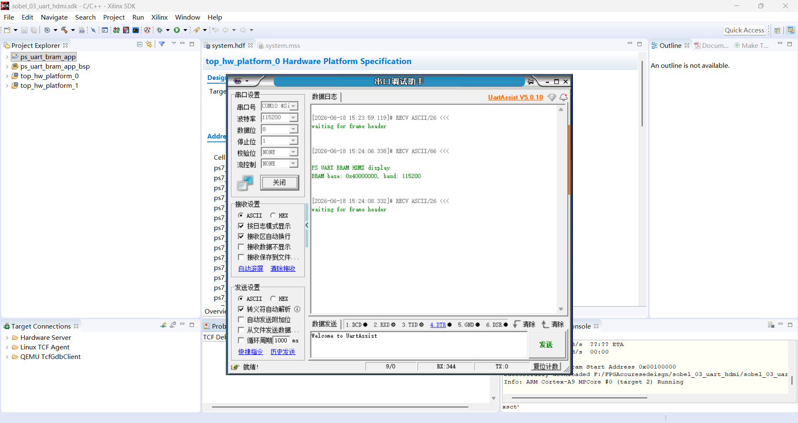
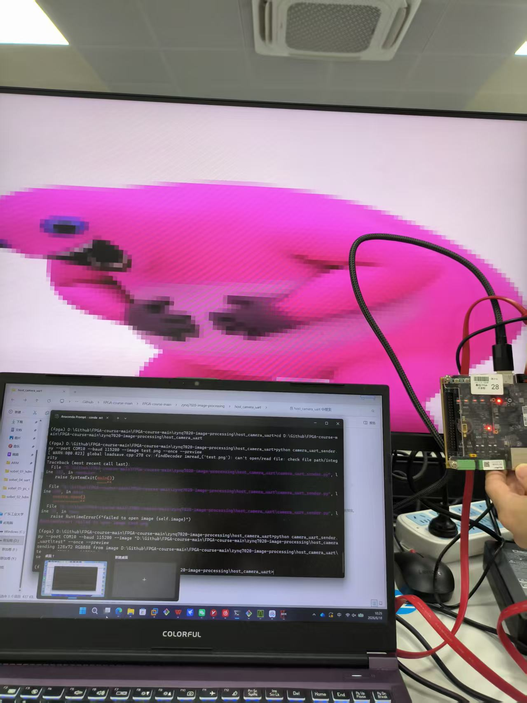
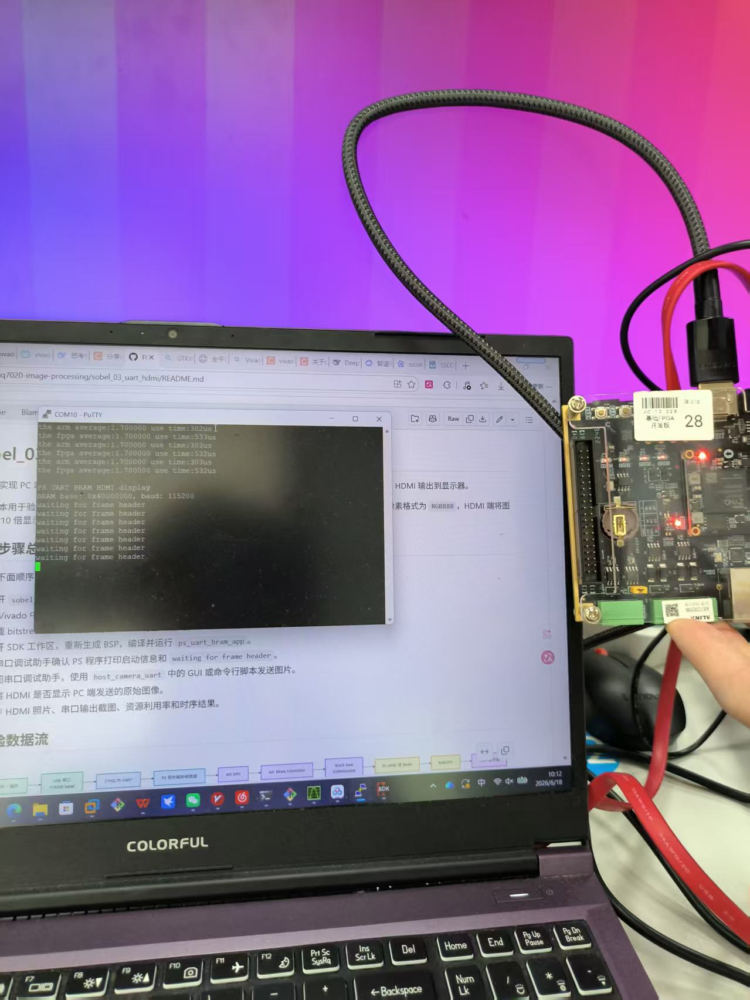
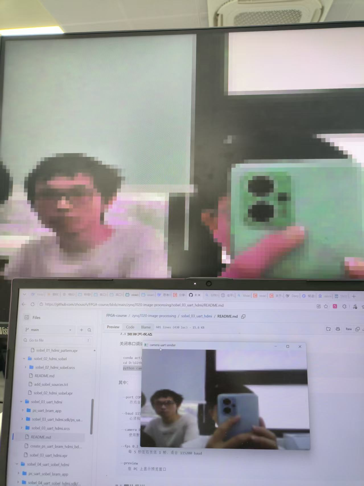
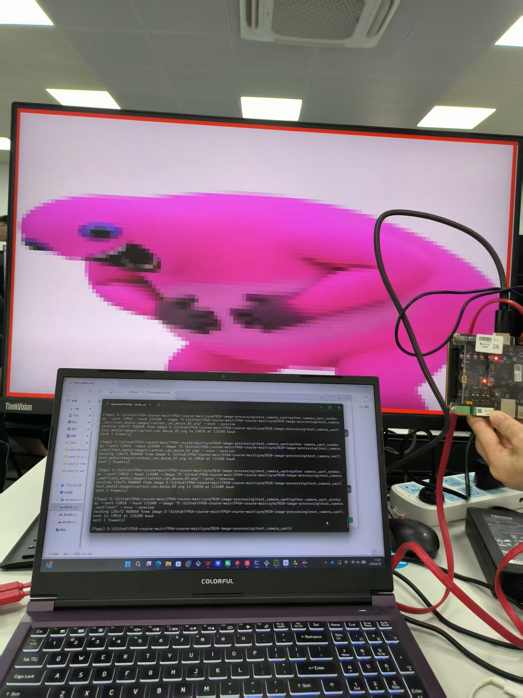
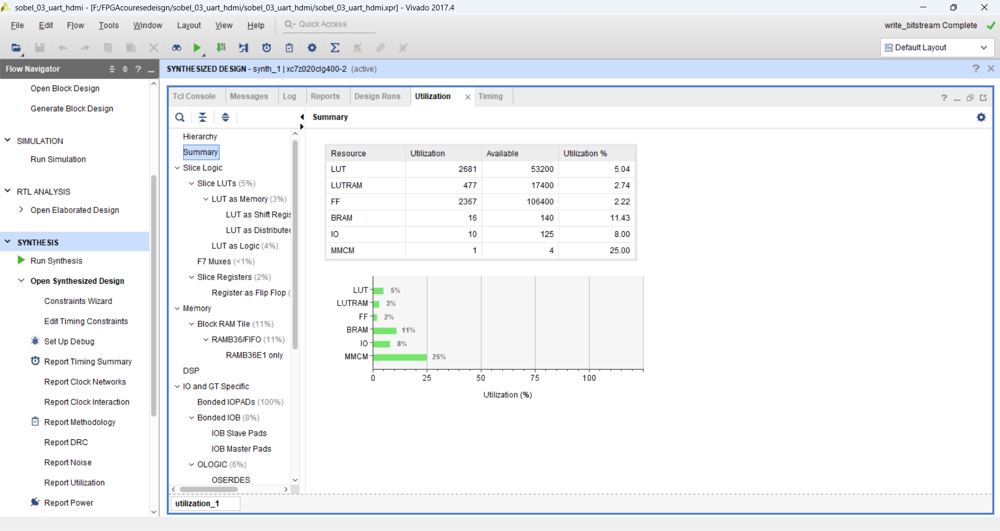
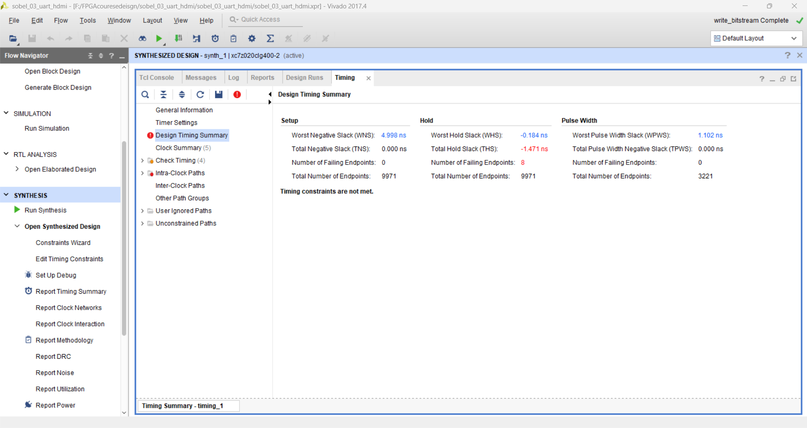

# 实验三：UART 图像传输与 HDMI 显示

## 一、实验目的

本实验在前两次 HDMI 显示实验的基础上，引入 Zynq PS 端和 PC 端串口输入链路，实现 PC 端通过 UART 将图像发送到开发板，PS 端接收图像帧并写入 AXI BRAM，PL 端从 BRAM 中读取图像并通过 HDMI 输出到显示器。

实验重点是验证 `PC -> UART -> PS -> AXI BRAM -> PL -> HDMI` 的完整数据通路。基础功能使用 `128 x 72`、`RGB888` 图像格式，串口波特率设置为 `115200`。在基础功能完成后，进一步在显示侧加入红色边框效果，用于标识有效图像显示区域。

## 二、系统总体结构

系统数据流如下：

```text
PC 图片 / 摄像头
    -> USB 串口
    -> ZYNQ PS UART
    -> PS 软件解析帧数据
    -> AXI GP0
    -> AXI BRAM Controller
    -> Block RAM
    -> PL HDMI 读 BRAM
    -> RGB2DVI
    -> HDMI 显示器
```

其中，PC 端上位机负责将图片或摄像头图像缩放到 `128 x 72` 并按帧格式发送；PS 端 `ps_uart_bram_app` 负责串口接收、帧头识别、行数据解析和 BRAM 写入；PL 端 `hdmi_bram_display.v` 负责从 BRAM 中读取 RGB888 像素，并按 HDMI 时序输出到显示器。

## 三、串口帧格式与 PS 端处理

本实验的图像帧采用固定帧头和行头，便于 PS 端从连续串口字节流中恢复图像边界。

| 字段 | 含义 |
| --- | --- |
| `55 AA` | 帧同步头 |
| `width[15:0]` | 图像宽度，小端格式 |
| `height[15:0]` | 图像高度，小端格式 |
| `format` | 图像格式，`0x18` 表示 RGB888 |
| `33 CC` | 行同步头 |
| `row[15:0]` | 当前行号，小端格式 |
| `R G B ...` | 当前行全部像素数据 |

PS 端程序中的关键参数为：

```c
#define IMG_WIDTH        128U
#define IMG_HEIGHT       72U
#define RGB888_FORMAT    0x18U
#define UART_BAUD_RATE   115200U
```

串口接收程序首先搜索帧头 `0x55 0xaa`，随后读取宽度、高度和格式字段。只有当图像尺寸为 `128 x 72` 且格式为 RGB888 时，程序才继续接收后续行数据。每一行开始前需要识别行同步头 `0x33 0xcc`，并检查行号是否与期望行号一致。

BRAM 中每个像素占 32 bit，低 24 bit 保存 RGB888 数据。写入地址计算方式为：

```c
offset = ((y * IMG_WIDTH) + x) << 2;
pixel  = (r << 16) | (g << 8) | b;
Xil_Out32(FRAMEBUFFER_BASEADDR + offset, pixel);
```

这样，PL 端只需要按照相同的 `y * 128 + x` 地址顺序读取 BRAM，即可恢复 PC 端发送的图像。

## 四、PL 端 HDMI 读取与显示

PL 显示模块的核心文件为 `hdmi_bram_display.v`。该模块产生 `1280 x 720` HDMI 时序，并在有效显示区域内将 BRAM 图像放大显示。当前显示参数如下：

```verilog
localparam IMG_WIDTH  = 128;
localparam IMG_HEIGHT = 72;
parameter integer SCALE_X = 8;
parameter integer SCALE_Y = 8;
parameter [11:0] OFFSET_X = 12'd128;
parameter [11:0] OFFSET_Y = 12'd72;
```

由于 `128 x 72` 图像按 8 倍放大后为 `1024 x 576`，因此通过 `OFFSET_X=128` 和 `OFFSET_Y=72` 将图像居中显示在 `1280 x 720` 画面中。图像外侧区域使用背景色填充。

PL 端 BRAM 读取地址为：

```verilog
assign image_word_addr = {image_y, 7'b0} + {7'd0, image_x};
bram_addr_reg <= video_active ? {16'd0, image_word_addr, 2'b00} : 32'd0;
```

其中 `{image_y, 7'b0}` 等价于 `image_y * 128`，末尾拼接 `2'b00` 表示每个像素按 32 bit 对齐寻址。

## 五、串口与 SDK 运行结果

SDK 中运行 `ps_uart_bram_app` 后，串口调试助手能够看到程序启动信息、BRAM 基地址和波特率信息。串口截图如下：



图 1 PS 端串口输出信息

从截图可以看到，程序打印了：

```text
PS UART BRAM HDMI display
BRAM base: 0x40000000, baud: 115200
waiting for frame header
```

这说明 PS 端 UART 初始化成功，BRAM 基地址识别正常，并且程序已经进入等待 PC 图像帧头的状态。

## 六、基础功能上板现象

基础功能测试中，PC 端通过上位机选择图片并通过串口发送到开发板。开发板接收到完整图像帧后，PS 将图像写入 BRAM，PL 端从 BRAM 读取并通过 HDMI 显示。



图 2 PC 端单张图片发送与 HDMI 显示结果

从图中可以看到，PC 端命令行显示正在向串口发送 `128 x 72` RGB888 图像，HDMI 显示器同步显示了发送的图像内容。由于输入图像分辨率较低并进行了放大，显示结果存在明显像素块，这是本实验固定输入规格下的正常现象。

基础测试过程中还记录了串口等待帧头和运行状态：



图 3 串口等待帧头状态记录

该状态说明 PS 程序在未接收到上位机数据时会持续等待合法帧头，不会误写 BRAM。

在 PC 端摄像头输入测试中，上位机将摄像头画面缩放为 `128 x 72` 后发送到开发板，HDMI 输出如下：



图 4 摄像头输入经 UART 传输后的 HDMI 显示结果

该结果表明，系统不仅能显示单张图片，也可以接收来自 PC 摄像头的图像输入。受限于 `115200` 波特率，刷新速度较慢，更适合进行单帧或低帧率图像验证。

## 七、拓展功能：红色边框显示

在基础 UART 图像显示链路通过后，进一步加入红色边框显示效果。该拓展用于标识 HDMI 中的有效图像显示区域，便于观察图像缩放和显示位置是否正确。



图 5 加入红色边框后的 HDMI 显示结果

从图中可以看到，发送的图像内容正常显示，同时显示区域外沿出现红色边框。该结果说明边框标记与 BRAM 图像读取逻辑可以同时工作，且不会破坏串口图像传输链路。

## 八、综合实现、资源占用与时序结果

工程已完成综合、实现并生成 bitstream，生成文件为：

```text
sobel_03_uart_hdmi.runs/impl_1/top.bit
```

资源利用率截图如下：



图 6 Vivado 资源利用率结果

关键资源占用如下：

| 资源 | 使用量 | 器件总量 | 利用率 |
| --- | ---: | ---: | ---: |
| Slice LUTs | 2075 | 53200 | 3.90% |
| Slice Registers | 1999 | 106400 | 1.88% |
| Block RAM Tile | 16 | 140 | 11.43% |
| DSPs | 0 | 220 | 0.00% |
| Bonded IOB | 10 | 125 | 8.00% |
| BUFGCTRL | 4 | 32 | 12.50% |

BRAM 资源主要用于图像帧缓存和 Block Design 中的 AXI BRAM；LUT 和寄存器用于 HDMI 时序、地址映射、AXI/BRAM 连接及控制逻辑。本实验没有复杂乘法运算，因此 DSP 使用量为 0。

时序结果截图如下：



图 7 Vivado 时序结果

关键时序指标如下：

| 指标 | 数值 |
| --- | ---: |
| WNS | 5.266 ns |
| TNS | 0.000 ns |
| WHS | 0.055 ns |
| THS | 0.000 ns |
| WPWS | 1.102 ns |

Vivado 报告显示所有用户指定时序约束均满足。路由报告中 `fully routed nets` 为 3520，`nets with routing errors` 为 0，说明设计能够稳定完成布线并生成 bitstream。

## 九、问题分析

本实验调试时需要注意串口占用问题。串口调试助手和 PC 上位机不能同时打开同一个 COM 口，否则上位机无法发送数据，或者串口助手无法接收 PS 输出。因此验证流程通常是：先打开串口调试助手确认 PS 程序进入 `waiting for frame header` 状态，然后关闭串口调试助手，再运行上位机发送图片。

第二个需要注意的问题是串口带宽。`128 x 72` RGB888 图像单帧数据量约为 `128 x 72 x 3 = 27648` 字节，再加上帧头和行头，在 `115200` baud 下传输一帧需要较长时间。因此摄像头输入适合低帧率预览，不能期待像普通视频一样流畅。

第三个问题是 PS 与 PL 对 BRAM 地址格式必须保持一致。PS 端按 32 bit 写入 `0x00RRGGBB`，PL 端也按 word 地址读取，并取低 24 bit 作为 RGB888 输出。如果两端地址步进或像素格式不一致，HDMI 画面会出现错位、颜色异常或局部乱码。

## 十、实验总结

本实验完成了 PC 端图像经 UART 发送、PS 端接收解析、AXI BRAM 写入以及 PL 端 HDMI 显示的完整链路。上板结果表明，系统能够正确显示 PC 端发送的单张图片，也能够接收摄像头输入并在 HDMI 上显示。串口调试信息显示 PS 程序初始化成功，能够进入等待帧头状态并接收图像帧。

在拓展部分中，显示侧加入红色边框，用于标识有效图像显示区域。综合实现结果显示工程资源占用较低，时序裕量为正，路由无错误。该实验为后续在 PC 端更换输入源、增加图像处理模式以及实现 PS/PL 协同处理奠定了基础。
