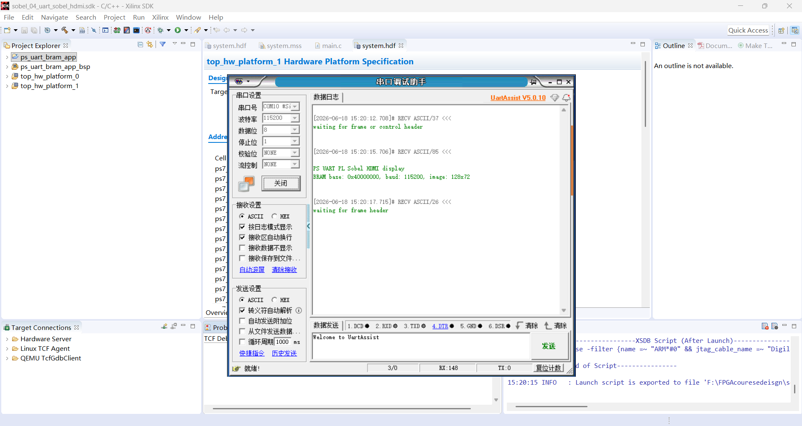
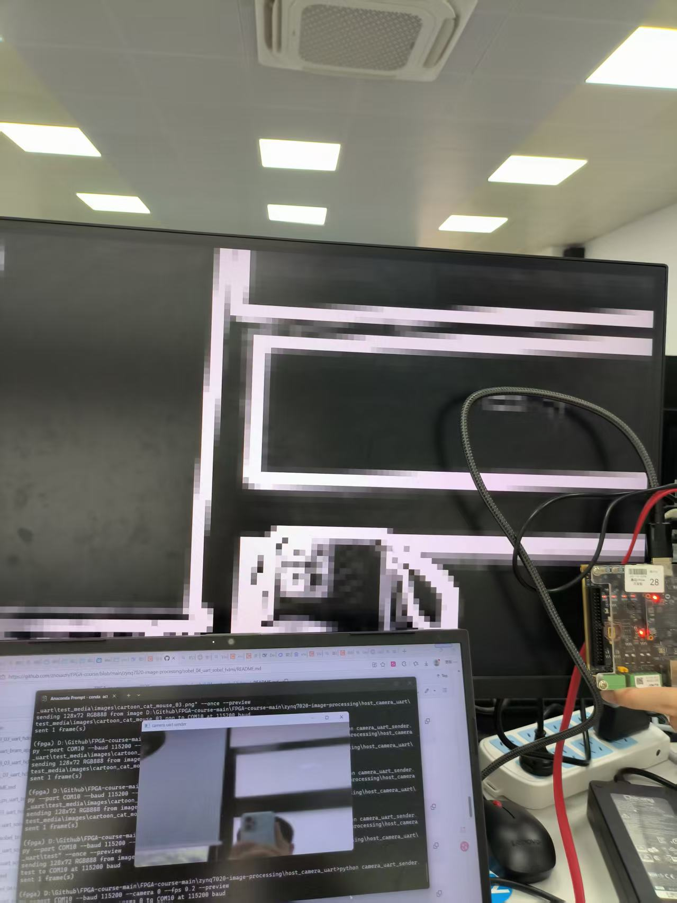
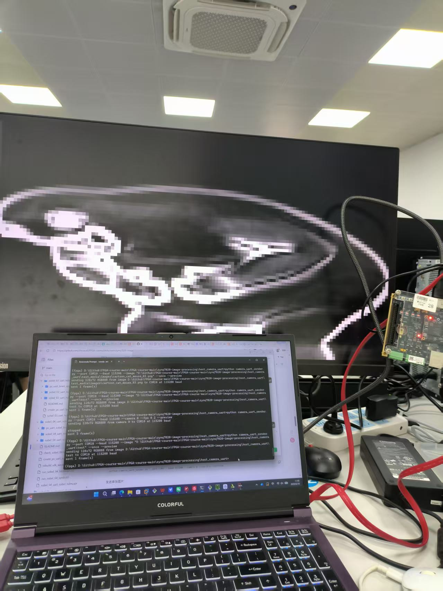
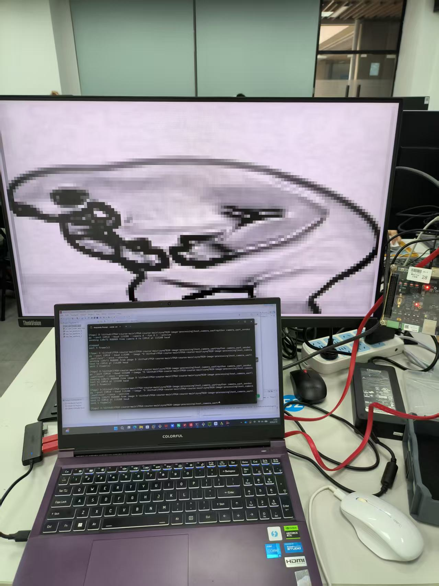
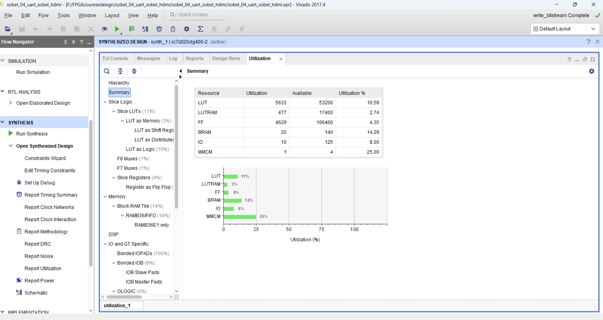
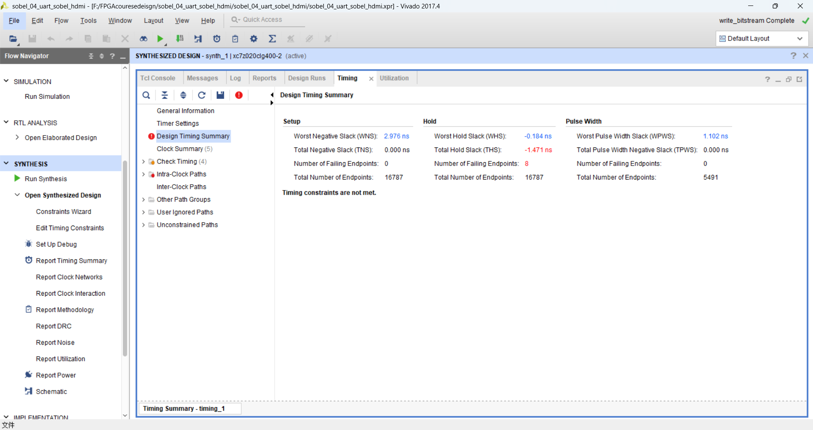

# 实验四：UART 输入图像的 Sobel 边缘检测与 HDMI 显示

## 1. 实验目的

本实验在 `sobel_03_uart_hdmi` 的基础上进一步加入 PL 端 Sobel 边缘检测功能。PC 端通过串口发送 `128 x 72` 的 RGB888 图像数据，ZYNQ PS 端接收图像并写入 AXI BRAM，PL 端从 BRAM 中读取原始 RGB 图像，完成灰度转换和 Sobel 边缘检测，最后将边缘检测结果通过 HDMI 输出到显示器。

实验主要完成以下内容：

1. 复用 PC 到 PS 的 UART 图像传输链路。
2. 复用 PS 写入 AXI BRAM、PL 从 BRAM 读取图像的共享存储结构。
3. 在 PL 侧完成 `rgb_to_gray` 灰度转换和 `sobel_core` 边缘检测。
4. 在 HDMI 显示端输出 Sobel 边缘图像。
5. 在拓展部分实现边缘图像的颜色反转显示。

## 2. 系统总体结构

本实验的数据流如下：

```text
PC 摄像头 / 单张图片
        |
        | UART, 115200 baud, RGB888 frame
        v
ZYNQ PS UART 接收程序
        |
        | AXI 写入 BRAM，地址 = base + ((y * 128 + x) << 2)
        v
AXI BRAM 原始图像缓存
        |
        | PL 逐像素读取 0x00RRGGBB
        v
rgb_to_gray 灰度转换
        |
        v
sobel_core 3x3 边缘检测
        |
        v
edge_mem 边缘图缓存
        |
        v
HDMI 1280 x 720 放大显示
```

与实验三相比，本实验不再直接显示 BRAM 中的 RGB 原图，而是在 PL 端加入灰度化和 Sobel 运算后再显示边缘结果。因此，PS 端主要负责串口接收和 BRAM 写入，PL 端负责实时图像处理和 HDMI 输出。

## 3. 输入图像与串口帧格式

本实验保持固定处理尺寸：

| 项目 | 参数 |
| --- | --- |
| 图像尺寸 | `128 x 72` |
| 输入格式 | RGB888 |
| 串口波特率 | `115200` |
| BRAM 像素格式 | `0x00RRGGBB` |
| BRAM 基地址 | `0x40000000` |

PC 端发送图像前将摄像头画面或单张图片缩放到 `128 x 72`，再按行发送 RGB888 数据。PS 程序接收帧头、宽高、格式字段和每行数据后，将像素写入 AXI BRAM。核心地址计算方式为：

```c
offset = ((y * IMG_WIDTH) + x) << 2;
pixel  = ((u32)r << 16) | ((u32)g << 8) | (u32)b;
Xil_Out32(FRAMEBUFFER_BASEADDR + offset, pixel);
```

串口调试助手中可以观察到 PS 程序启动信息和等待帧头信息，如图 1 所示。该信息说明 SDK 程序已经运行在 ARM 端，并且正在等待 PC 端发送图像帧。



图 1 串口初始化与等待图像帧信息

## 4. 关键模块说明

### 4.1 PS 端接收程序

PS 端程序位于：

```text
ps_uart_sobel_bram_app/src/main.c
```

程序主要完成以下功能：

1. 初始化 `XUartPs`，设置波特率为 `115200`。
2. 接收 PC 端发送的图像同步头和图像参数。
3. 校验图像宽高是否为 `128 x 72`，格式是否为 RGB888。
4. 按行接收 RGB 数据并写入 AXI BRAM。
5. 当长时间未收到帧头时输出 `waiting for frame header`，便于判断程序是否仍在运行。

PS 程序本身不进行 Sobel 运算，图像处理任务交给 PL 端完成，这样可以体现 FPGA 并行处理图像数据的优势。

### 4.2 PL 端灰度转换

灰度转换模块 `rgb_to_gray.v` 使用常见的加权灰度公式：

```verilog
gray = (77 * R + 150 * G + 29 * B) >> 8
```

该近似公式对应：

```text
Gray ≈ 0.299R + 0.587G + 0.114B
```

这样可以避免使用浮点运算，适合在 FPGA 中用整数乘加实现。

### 4.3 Sobel 边缘检测

`sobel_core.v` 使用两行缓存和 3x3 滑动窗口构造当前像素邻域，并分别计算水平方向和竖直方向梯度：

```text
Gx = -p00 + p02 - 2p10 + 2p12 - p20 + p22
Gy = -p00 - 2p01 - p02 + p20 + 2p21 + p22
```

输出边缘强度采用近似幅值：

```text
|Gx| + |Gy|
```

当计算结果超过 255 时进行饱和处理。图像边界处缺少完整 3x3 邻域，因此边界像素输出为 0。

### 4.4 HDMI 显示与放大

`hdmi_bram_sobel_display.v` 每个视频帧开始时扫描 BRAM 中的 `128 x 72` 原图，将处理后的边缘结果写入内部 `edge_mem`。HDMI 显示时再从 `edge_mem` 中读取边缘值，并放大到 `1280 x 720` 输出。

基础显示模式下，边缘强度直接复制到 RGB 三个通道：

```text
R = edge
G = edge
B = edge
```

显示效果为黑底白边，较强的图像边缘会显示为亮色。

## 5. 基础实验现象

### 5.1 摄像头输入

使用 PC 端上位机选择摄像头输入，发送到开发板后，HDMI 显示器上可以看到实时画面的 Sobel 边缘检测结果。画面中的显示器边框、桌面物体边缘和开发板轮廓均被提取出来，说明 UART 传输、PS 写 BRAM、PL Sobel 运算和 HDMI 输出链路可以闭环工作。



图 2 摄像头输入下的 Sobel 边缘检测显示

### 5.2 单张图片输入

将单张图片通过上位机发送到开发板后，HDMI 输出图像中可以看到原图主体轮廓被提取出来。由于输入图像在发送前被缩放到 `128 x 72`，放大到 HDMI 屏幕后会出现明显像素块，这是低分辨率处理尺寸在大屏显示下的正常现象。



图 3 单张图片输入下的 Sobel 边缘检测显示

## 6. 拓展功能：边缘图颜色反转

在基础黑底白边显示的基础上，本实验进一步实现了边缘图颜色反转显示。反转显示的核心逻辑为：

```verilog
wire [7:0] edge_inv;
assign edge_inv = 8'hFF - edge_pixel;

assign rgb_r = (de_reg_d0 && sobel_done) ? edge_inv : 8'h00;
assign rgb_g = (de_reg_d0 && sobel_done) ? edge_inv : 8'h00;
assign rgb_b = (de_reg_d0 && sobel_done) ? edge_inv : 8'h00;
```

反转后，弱边缘和背景接近白色，强边缘接近黑色，显示效果变为白底黑边。该方式不改变 Sobel 运算本身，只改变 HDMI 输出端的灰度映射。



图 4 Sobel 边缘图颜色反转显示效果

## 7. 资源利用率与时序结果

Vivado 资源利用率统计如图 5 所示。



图 5 Vivado 资源利用率统计

主要资源占用如下：

| 资源 | 使用量 | 总量 | 使用率 |
| --- | ---: | ---: | ---: |
| LUT | 5633 | 53200 | 10.59% |
| LUTRAM | 477 | 17400 | 2.74% |
| FF | 4629 | 106400 | 4.35% |
| BRAM | 20 | 140 | 14.29% |
| IO | 10 | 125 | 8.00% |
| MMCM | 1 | 4 | 25.00% |

相比实验三，本实验增加了灰度转换、Sobel 卷积和边缘缓存，因此 LUT、FF 和 BRAM 占用均有所增加，但总体资源占用仍处于较低水平，能够满足 ZYNQ7020 器件资源要求。

Vivado 时序结果如图 6 所示。



图 6 Vivado 时序结果

从截图可以看到，Setup 方向 WNS 为 `2.976 ns`，没有 Setup 违例；Pulse Width 方向 WPWS 为 `1.102 ns`，也没有脉宽违例。Hold 方向出现少量负裕量，WHS 为 `-0.184 ns`，失败端点数为 8。该截图记录的是综合设计阶段的时序摘要，本次上板功能验证已经完成；后续若继续完善工程，应以实现后的 routed timing 为最终依据，并进一步检查跨时钟路径和相关约束。

## 8. 遇到的问题与处理

1. 串口不能被多个程序同时占用。串口调试助手用于观察 SDK 输出时，上位机无法同时打开同一个 COM 口发送图像；发送图像前需要先关闭串口调试助手。
2. UART 速率较低，发送图像时帧率不宜设置过高。本实验中采用较低 FPS 进行发送，便于保证图像帧完整接收。
3. PC 端、PS 端和 PL 端必须保持一致的图像尺寸。本实验统一采用 `128 x 72`，如果修改尺寸，需要同步修改上位机缩放参数、PS 端宽高校验和 PL 端地址计算。
4. HDMI 画面像素块较明显，这是由于处理尺寸较低，并且 HDMI 端进行了整数倍放大；该现象不影响边缘检测链路验证。
5. 综合阶段时序摘要中存在少量 Hold 负裕量，后续可通过进一步完善约束、检查跨时钟路径或以实现后时序报告为准进行收敛。

## 9. 实验总结

本实验完成了从 PC 图像输入到 FPGA Sobel 边缘检测再到 HDMI 显示的完整链路。PS 端负责串口协议解析和 BRAM 写入，PL 端负责灰度转换、Sobel 运算和 HDMI 输出，实现了软硬件协同的图像处理流程。

基础部分分别使用摄像头输入和单张图片输入完成了上板验证，HDMI 上能够观察到对应图像的边缘检测结果。拓展部分在显示端加入颜色反转映射，实现了白底黑边的显示效果。整体来看，该实验在实验三的通信和显示链路上加入了实际图像处理算法，为后续实验五的显示控制和上位机扩展奠定了基础。
